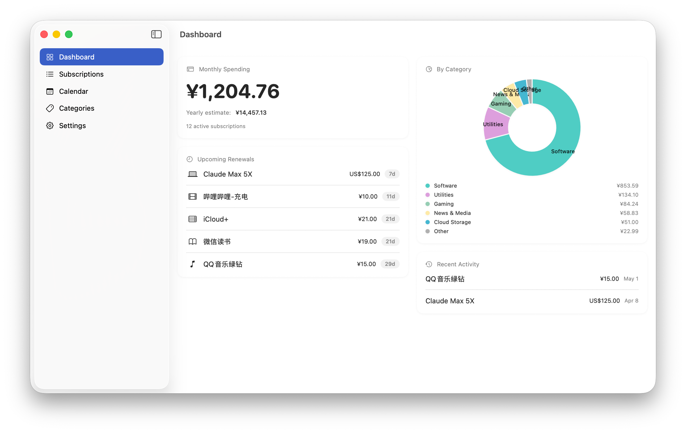
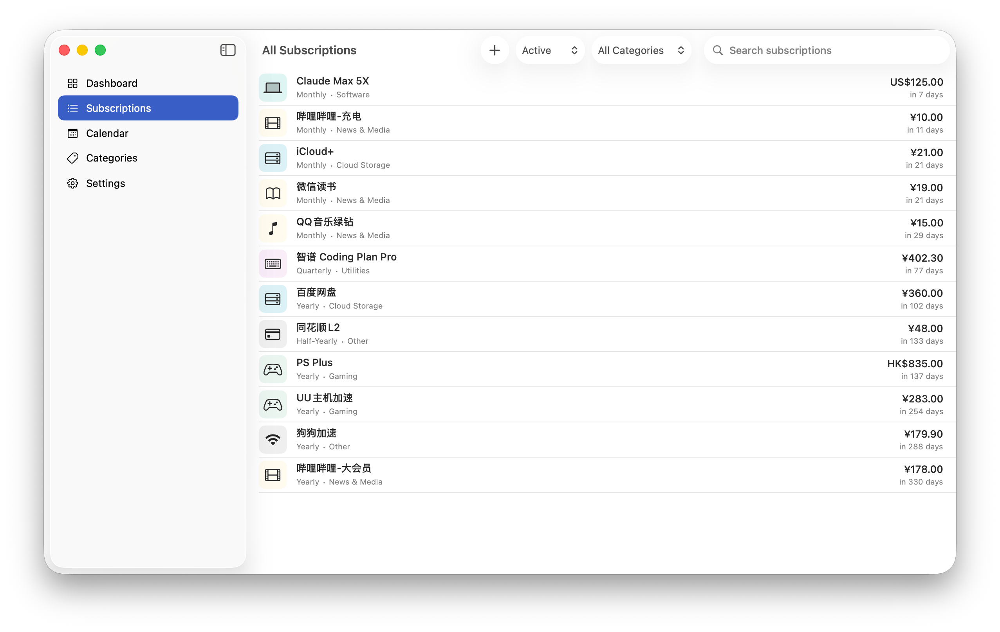

# Sotto

A multiplatform subscription tracker for iOS, iPadOS, and macOS. Sotto helps you keep tabs on recurring charges — what you pay, when it renews, and how it adds up across categories and currencies.

<div>
    
    
</div>

## Features

- Track subscriptions with name, icon, amount, currency, and billing cycle (weekly, monthly, quarterly, half-yearly, yearly).
- Dashboard with monthly / yearly spending totals, category breakdown chart, and a renewal timeline.
- Categories and payment methods to organize subscriptions.
- Multi-currency support with live exchange rate conversion to a chosen base currency.
- Inspector pane for quick edits, plus payment history per subscription.

## Tech Stack

- **Swift 6.0**, SwiftUI, SwiftData
- **Targets:** iOS 26.0+, macOS 26.0+
- **Package:** Swift Package Manager (`Package.swift`) exposes the shared `SottoKit` module.
- **Project generation:** [XcodeGen](https://github.com/yonaskolb/XcodeGen) (`project.yml`)

## Getting Started

```bash
xcodegen generate
open Sotto.xcodeproj
```

Build and run the `Sotto` scheme.

## Project Layout

```
Sotto/
├── App/           # App entry point
├── AppSupport/    # Model container, schema, and launch support
├── Models/        # SwiftData models (Subscription, Category, PaymentMethod, …)
├── Services/      # BillingCycleCalculator, CurrencyService
├── Views/         # Dashboard, Subscriptions, Categories, Sidebar, Settings, Components
└── Extensions/    # Model conveniences
```
